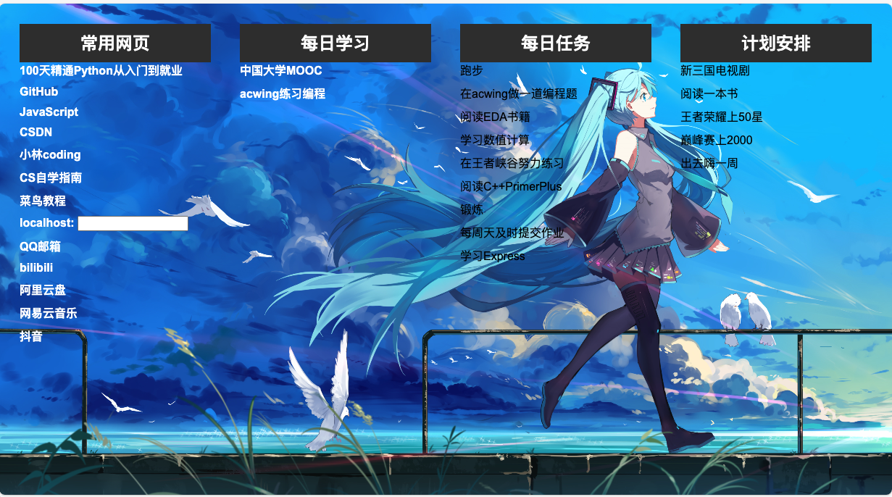

# 我的浏览器导航页

https://github.com/JiqingJiang/my_navigation

## 初心
本仓库是我刚接触Github不久，刚了解到可以使用Github的Page部署一个静态网页时随便写的。最初的目的是因为我经常会打开浏览器，然后在收藏夹寻找自己常访问的链接，然后就想能不能每次打开浏览器
直接跳出来一个导航页，类似于360浏览器`https://hao.360.com/`，一打开之后有许多的超链接，同时还能有提醒自己今年的年计划目标等的东西的一个页面，于是我在闲暇时间瞎玩了玩，于是就有了这个
仓库。

## 后来
后来随着自己了解的东西多了，有了博客、obsidian，等其他的高效的笔记软件，我的目标，日记啥的也转移到了其他地方，这个仓库部署的静态网页也没有用过，简陋质量不高，曾好几次想删掉这个仓库，
但想了想，毕竟是自己刚开始从一个啥也不知道，甚至连GitHub都不会用的小白的时候的一丝探索，所以想了想，还是别删了，就扔在这放着吧。

## 设计一个自己的浏览器导航页
其实在我有这个想法，想做一个导航页的时候，我其实没有学过前段，大概知道html，其余的都不怎么会，我是使用chatGPT描述我的需求，让它帮我设计，现在回想当时，我用的chatGPT都是盗版的别人写的
接口，那时候还没chatGPT3.5和4.0。所以不太懂也没关系，就是玩，让chatGPT帮你整就好。
